<h1 align="center">FlipFlex</h1>

<p align="center">
  <b>Plex. On a flip phone.</b><br>
  <sub>240×320. No touchscreen. Twelve number keys, a D-pad and two soft keys.</sub>
</p>

<p align="center">
  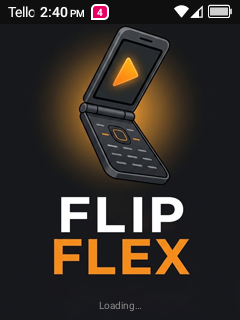
  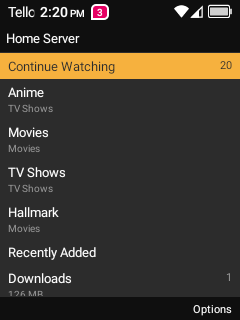
  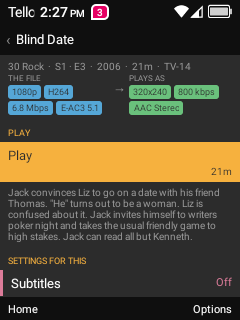
</p>

---

The TCL 4058G is the cheap clamshell you buy when you want a phone that is only
a phone. A 2.4-inch screen, 916 MB of RAM, a 32-bit MediaTek chip from 2016, and
a keypad. It is not supposed to run apps at all — TCL patched
`PackageManagerService` so that it refuses to install any.

FlipFlex is a Plex client for it. It signs in with `plex.tv/link`, finds your
server, browses your libraries, asks the server to transcode down to 320×240,
plays the result on the hardware decoder, reports your position back so the
resume point follows you to the TV, and downloads episodes to the phone so they
play with both radios switched off.

It works. Not as a demo — it is what one of these phones does on a train now.

<p align="center">
  <br>
  <sub>Six presses of →, fifteen seconds each, on a transcode coming off the
  server live. Yes, that is the actual screen.</sub>
</p>

---

## Read this first: your phone has to be modded

**FlipFlex cannot be installed on a stock 4058G.** Not "is awkward to" — cannot.
TCL ships a patched `PackageManagerService` that refuses every APK install unless
a hidden read-only property, `ro.vendor.tct.endurance`, is true. There is no
setting for it and it cannot be set without root.

The refusal even lies about why:

```
adb: Failure [INSTALL_FAILED_INSUFFICIENT_STORAGE: Failed rename]
```

…with 11 GB free. Storage has nothing to do with it.

Getting past that means unlocking the bootloader, dumping your own boot image,
patching it with Magisk and flashing it back. That is a whole project on its
own, so it *is* a whole project on its own:

### → **[jackharvest/tcl-flip-macos-unlock](https://github.com/jackharvest/tcl-flip-macos-unlock)**

Tools plus a `docs/traps.md` of every silent failure that cost us a day. Do that
first, come back here.

> [!WARNING]
> **The unlock repo was written against one specific handset**, a 4058G on
> build `Gflip6_NA_OM` / `UPCI`, and flashing is exactly the operation where a
> near-miss is not a miss. The 4058 family is a zoo — 4058W, 4058E, T408DL, and
> firmware branches KEEZ, KEFS, KEKA, KEE7, QK6J — and there are people in the
> community's issue tracker who flashed an image built for the wrong branch and
> got a bootloop. **Check `ro.product.model` and `ro.build.display.id` against
> what the unlock repo says before you write anything.** If they do not line up,
> the recipe may still be right in outline and wrong in every detail, and you
> get to redo the "dump your own boot image" part yourself. Take a full backup
> either way. That advice is free; a replacement phone is not.

## Install

Unlock the phone first, so that installs are allowed at all. Then take
`flipflex-<version>.apk` from
[**Releases**](https://github.com/jackharvest/FlipFlex/releases/latest) and:

```sh
adb install flipflex-1.0.0.apk
```

Open it. It teaches you the keypad, then asks you to sign in.

Updating later is just `adb install -r` over the top — the release APKs are all
signed with the same key, so your login, your settings and your downloads stay
where they are.

<details>
<summary>Optionally: put it in the phone's own Menu</summary>

A sideloaded app does not appear in the 4058G's Menu no matter how correct its
manifest is. TCL's Launcher3 does not enumerate installed apps — it walks a
hardcoded array of package names and drops everything not in it, which is why
Magisk is invisible too. `tools/install-menu-overlay.sh` ships a runtime resource
overlay as a Magisk module that adds one entry to that array. It needs root and
a reboot. See [`docs/launcher-menu.md`](docs/launcher-menu.md).

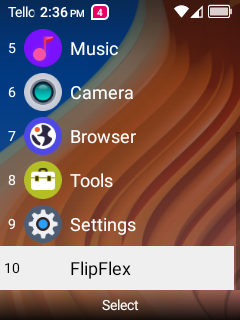

That is what puts FlipFlex at item 10, next to Settings and Tools, so the phone
treats it like something that came with it.

It is also the reason the package is `com.github.jackharvest.flipflex` and not
`io.github…`: Launcher3 only treats an array entry as a package name if it starts
with `com` or `org`. With the `io.` name the entry did not error — it fell down a
different branch and silently rendered as a second, iconless "Tools" folder.

<br clear="all">
</details>

---

## What it does

### It teaches you the keypad, once

None of this is guessable. Neither soft key is Back. The green call key is
Search. Two keys on the top row quit the app and open the stock mail client. So
the first launch draws the handset and lights one control at a time — twelve
steps, before anything else, including before the sign-in screen, because that
screen already has to be navigated with keys nobody has been told about.

<p align="center">
  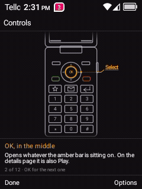
  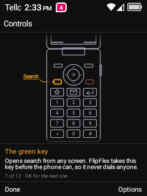
  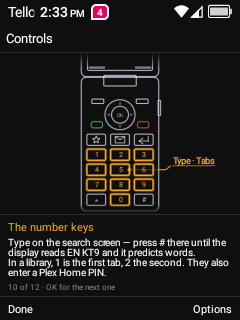
</p>

The phone in that picture is drawn on a canvas, not a bitmap. An open flip phone
is about one unit wide to three and a half tall, so scaling a photo into the
content area makes the whole handset seventy pixels across and the keypad
unreadable. Drawing it lets the top shell be truncated — the screen is not a
control — and gives that height to the keypad instead. It also means a key can
light up.

Settings → Help → Controls reopens it forever after.

### Signing in is four characters

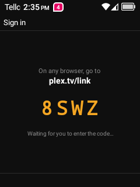

The standard `plex.tv/link` flow. The phone shows a four-character code, you
type it into a browser on something with a keyboard, and the phone picks it up.
No typing an email address on a numeric keypad.

The token is then treated as precious. An earlier build signed you out whenever
`plex.tv` could not be reached — which meant *opening the app with no signal
wiped the login*, on a phone whose entire offline story is a folder of downloads
for a train. A token is now only ever discarded because a server actually said
401.

<br clear="all">

### Browsing

<p align="center">
  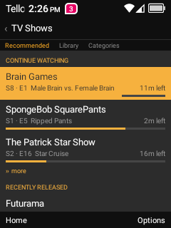
  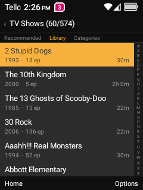
  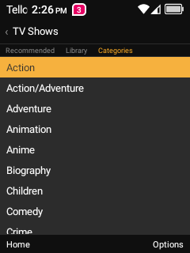
</p>

Every library has three views — **Recommended**, **Library**, **Categories** —
on a tab strip you reach by pressing ↑ off the top row. Or by pressing `1`, `2`
or `3`, which matters when you are 400 titles deep in an A-Z of 574 shows and
want the top of the screen back.

The A-Z rail down the right edge is a jump list. `*` and `#` page. Categories is
genres pulled off the server, and browsing one really filters — Action is 598 of
1746 films, not a relabelled everything.

<p align="center">
  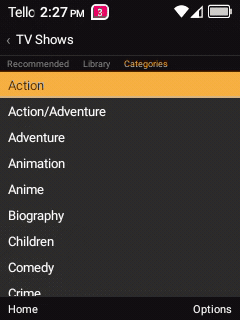
  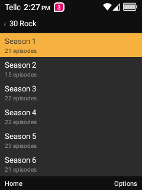
  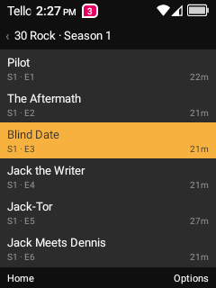
</p>

Continue Watching sits at the top of the home screen and is not a submenu. On a
phone that gets opened for four minutes at a time, the shortest path from
lid-open to playing the thing you were already watching is the whole feature.

### The details page tells you what is about to happen

<p align="center">
  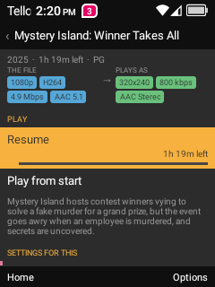
  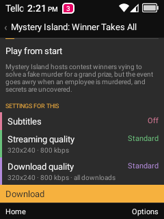
  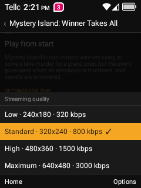
</p>

Two columns and an arrow: what the file **is**, and what will actually reach the
screen. `1080p · H264 · 4.9 Mbps · AAC 5.1` on the left, `320×240 · 800 kbps ·
AAC Stereo` on the right. The colours mean the same four things everywhere in the
app — blue is the file as it exists, green is what gets decoded here, violet is
storage on the phone, rose is subtitles.

Subtitles are **burned in** rather than rendered as a track. ExoPlayer can draw
text subtitles perfectly well, but it cannot draw PGS or VOBSUB at all — which is
what a Blu-ray rip carries — so a soft path would have worked on half a library
and silently done nothing on the rest. Everything is being transcoded anyway, so
burning them costs nothing and behaves identically for every file. There is a
size setting because Plex's default of 100% is sized for a television.

### Playing

<p align="center">
  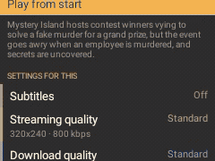
  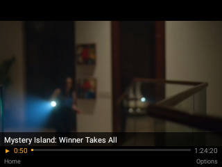
</p>

The player is landscape, and that is worth 1.8× the picture: turned sideways the
panel is 320×240, so a 16:9 video is 320×180 instead of 240×135.

It is specifically *reverse* landscape by default, for a reason no spec sheet
contains — plain landscape puts the edge carrying the power button and the
headphone jack along the bottom, so a phone with anything plugged into it cannot
be stood on a table. The other way up sits flat. All three orientations are in
the Options menu and switching one does not restart playback.

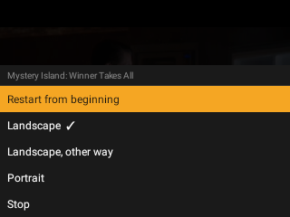

The controls fade six seconds after playback *actually starts*, not six seconds
after you pressed the key — the key press happens while the server is still
opening the transcode, and fading there leaves you watching a black rectangle
with nothing on it to explain itself. Anything that is not playing pins them back
up. Any key brings them back.

Closing the lid pauses and posts your position to Plex. Opening it again does
**not** resume, deliberately: a media app that starts making noise the moment the
phone is opened is a liability in a meeting.

<br clear="all">

### Search is the green key

<p align="center">
  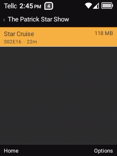
  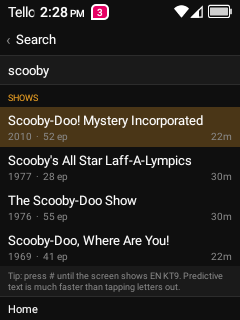
  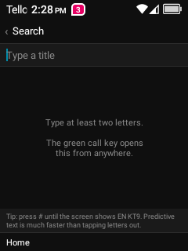
</p>

The call button is the one genuinely spare hardware key on the phone, and FlipFlex
catches it before the dialer can, from every screen except the player. Results
come back grouped the way Plex groups them.

The line at the bottom about `EN KT9` is there because the phone ships a real T9
IME and predictive mode is *not* something an app can read — the mode lives inside
the keyboard and is exposed nowhere — so the tip is shown to everyone rather than
only to the people who need it.

### Downloads, and then aeroplane mode

<p align="center">
  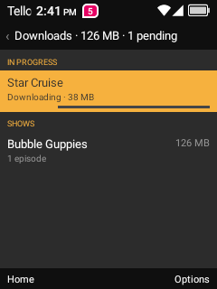
  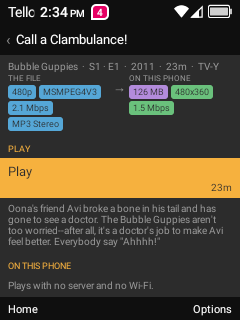
  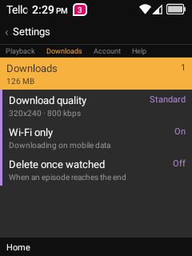
</p>

Pick Download on any episode and it is fetched as one file at whatever quality
you chose, by a foreground service that survives the lid being shut. Downloads
default to Wi-Fi only — asking for one on mobile data queues it, and it starts
itself the next time there is Wi-Fi rather than making you press the button
again.

Then turn everything off. Cold-start the app with no Wi-Fi and no mobile data
and you get the Downloads library, your login intact, and files that play off
local storage on the hardware decoder.

### Settings

<p align="center">
  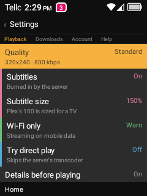
  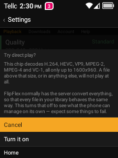
  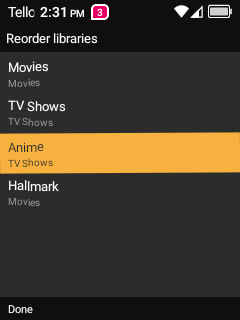
</p>

Four tabs, each shorter than the screen, each one digit away. Anything with a
real cost asks first, with Cancel under the cursor. And the home screen's library
order is yours — Options → Reorder libraries, OK to pick a library up, up and
down to carry it, OK to put it down.

<p align="center">
  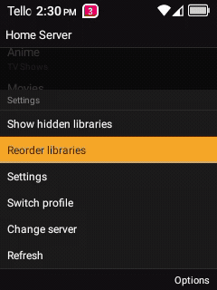
</p>

---

## The keypad

23 keys reach the app. Measured with an instrumented build on the real handset,
not read off the `.kl` files and not injected with `adb shell input`, which
bypasses the driver and would have told us a comforting lie.

| Key | What it does |
|---|---|
| **D-pad ↑ ↓** | Move the selection |
| **D-pad ←** | **Up one level — a second Back** |
| **D-pad →** | Page ~7 rows, or step into the A-Z rail |
| **OK** | Select. On a details page, Play |
| **Back arrow** | Up one level |
| **Left soft key** | Home, from any depth |
| **Right soft key** | Options for whatever is highlighted |
| **Green call** | Search, from anywhere but the player |
| **1**–**9** | Pick that tab. Type on the search screen. Enter a Plex Home PIN |
| **\*** **#** | Page up / down |
| **↑ past the top row** | Into the tab strip, then onto the `‹ Title` header |
| **← →** in the player | Seek ∓15 s |
| Volume rocker | Left alone. The system's own handling is what people expect |

Two of those are load-bearing and neither is obvious.

**Left is a second Back.** It used to page backwards, which `*` already did. The
back arrow is one small mechanical key on a phone that is not new, and losing it
used to mean losing the ability to go up a level at all — the soft keys are Home
and Options, and neither is Back. So now there are three independent ways up:
the arrow, ←, and OK on the title header.

**Digits reach tabs directly.** In an A-Z of six hundred titles, getting back to
the Recommended strip meant holding ↑ and waiting. Out-of-range digits are
ignored rather than clamped — pressing 7 on a three-tab screen was not a request
for the last tab.

Full measured table, including the four keys that look available and are not, in
[`docs/keymap.md`](docs/keymap.md).

---

## Things that turned out to be interesting

The full versions live in [`docs/phase2-playback.md`](docs/phase2-playback.md),
which is the working runbook. These are the ones worth reading even if you never
touch this phone.

**A downloaded file could not be seeked, and Plex would not fix it.**
`start.mkv` is muxed live into the socket, so it arrives with a Segment of
unknown size and **no Cues element** — and Cues is the only thing ExoPlayer's
`MatroskaExtractor` builds a seek map from. With none, every `seekTo` collapses
to zero: six presses of forward left the clock at 0:01 and restarted the picture.
Plex ignores the extension (`start.mp4` and `start.ts` both return byte-identical
Matroska) and every profile that serves a single file gives MP3 audio, which
`MediaMuxer` cannot write into MP4, so remuxing was out too. So FlipFlex writes
the index itself: one linear walk, a cue point every five seconds, spliced in
*ahead of the first cluster* because the extractor parses forwards and never
follows the SeekHead. `dl/MatroskaIndex.kt`.

**`X-Plex-Platform: Android` cannot ask Plex for a file.** The universal
transcode endpoints are served per client profile, and the built-in Android
profile has no single-file form: `start.mkv` answers a bare 400 with 89 bytes of
HTML. The same request as `Chrome` returns 49 MB of Matroska. So streaming stays
honest as `Android` — which is what makes the server's session list say
`FlipFlex` — and downloads claim `Chrome`. Measuring it needs care, because Plex
refuses a new transcode for an item it thinks still has a live session and that
refusal is *item*-scoped, so run the four combinations back to back and they
contradict each other.

**A paused transcode gets reaped, and the failure arrives minutes later.** Plex
keeps a transcode alive on segment requests. Closing the lid stops those, so the
session is reaped — but the segments already produced are left behind. Playback
therefore resumes perfectly, runs for several minutes, and only then dies on the
first segment that was never written. `/status/sessions` showed FlipFlex playing
with no transcode session behind it at all. The moment of the error tells you
nothing about the cause.

**`optString` cannot be used on Plex JSON.** `JSONObject.optString(name,
fallback)` returns the fallback only when the key is *absent*. For a key that is
present and explicitly `null` it returns the four-character string `"null"`. Plex
uses explicit nulls everywhere, so this stored `"null"` as the account token and
walked straight past the sign-in screen.

**And `getprop` cannot see the property that blocks installs.** Not "returns
false" — returns *nothing*, identically, whether or not it is set, because the
name resolves to an SELinux context `adb shell` cannot open and both lookup paths
fail silently in the same direction. That one cost about eight flash-and-reboot
cycles chasing a bug that did not exist. It is written up in the unlock repo, in
bold, near the top.

---

## Building it

```sh
brew install openjdk@17
tools/build.sh              # assemble debug
tools/build.sh install      # …and adb install -r
tools/build.sh run          # …and launch it
```

Use the script rather than `./gradlew`. Homebrew's `openjdk@17` is keg-only, so
`/usr/libexec/java_home` cannot see it and Gradle reports `Unable to locate a
Java Runtime` in any shell that has not exported `JAVA_HOME` by hand.

`assembleRelease` produces an unsigned APK unless you have a keystore configured
at `~/.flipflex/keystore.properties`; see the comment at the top of
[`app/build.gradle.kts`](app/build.gradle.kts). `tools/release.sh` builds, signs
and publishes a tagged release in one go.

There are no native libraries and no HTTP dependency. Media3's core is pure Java
over MediaCodec, and `HttpURLConnection` is OkHttp underneath anyway — on a
handset with a 128 MB heap growth limit, a dependency you do not need is one you
should not carry.

<details>
<summary>The rest of <code>tools/</code></summary>

```sh
tools/usb-plex.sh <ip>          # reach a LAN Plex server over USB, not Wi-Fi
tools/install-menu-overlay.sh   # the Menu entry, as a Magisk module. Reboots
tools/release.sh [publish]      # signed release APK, tag, GitHub release
```

That is the whole of `tools/`, alongside `build.sh` above. Anything that writes
to a partition — dumping boot, patching it, flashing it back, taking a
`flash.bin` that can un-brick the phone — lives in
[**tcl-flip-macos-unlock**](https://github.com/jackharvest/tcl-flip-macos-unlock)
instead. That work happens once, before this repo is any use to you, and
keeping it in one place means there is only ever one copy of a script that can
brick a handset.

`usb-plex.sh` exists because **the handset drops its own Wi-Fi**: a
`CTRL-EVENT-DISCONNECTED reason=3 locally_generated=1` about eighteen seconds
after a clean four-way handshake, at −38 dBm, with no IPv4 ever assigned. DHCP
never completes and Android tears the un-provisioned link down. The AP is in
WPA2/WPA3 transition mode and the phone saved the network as SAE. That is not an
app bug, but it kills streams, and testing over the USB cable does not care what
the radio is doing.

</details>

---

## The phone, as measured

Everything here came off the real unit, not a spec sheet.

| | |
|---|---|
| Model / codename | `4058G` / `Gflip6_NA_OM` |
| Build | `TCL/4058G/Gflip6_NA_OM:11/RP1A.200720.011/UPCI:user/release-keys` |
| SoC | MT6739, **32-bit only** — `armeabi-v7a`, no `abilist64` |
| RAM | 916 MB, with `dalvik.vm.heapgrowthlimit=128m` |
| Screen | 240×320 at **density 160** — a true 240×320 dp canvas |
| Hardware decode | H.264, HEVC, VP9, MPEG2, MPEG4, VC1, XVID — all to 1600×960 |
| Storage | 11 GB free |

The density is the piece of luck the whole layout rests on. Had TCL shipped
240 dpi, the canvas would have been 160×213 dp and every measurement in this app
would have halved.

And the decoder table means the chip is **not** the constraint — it can decode
far more than a 240-wide viewport needs. The server's transcoder and the radio
are the constraints, which is why FlipFlex asks for 320×240 at 800 kbps and
forces a transcode so that one code path covers every file in the library.
Direct play is in Settings, off by default, and behind a panel that says what it
will and will not manage.

---

## Docs

| | |
|---|---|
| [`docs/phase2-playback.md`](docs/phase2-playback.md) | The runbook. What is proven, how it was checked, and every trap that cost time |
| [`docs/keymap.md`](docs/keymap.md) | The keypad as measured, what each key is bound to, and the tour that teaches it |
| [`docs/launcher-menu.md`](docs/launcher-menu.md) | How an invisible sideloaded app gets into the phone's Menu |
| [`CLAUDE.md`](CLAUDE.md) | Everything above, compressed, for whoever works on this next |

The unlock is written up in [**its own
repo**](https://github.com/jackharvest/tcl-flip-macos-unlock), including a
`docs/traps.md` of every silent failure it cost.

---

## Credits

[**neutronscott/flip2**](https://github.com/neutronscott/flip2) is where the
4058 community's knowledge lives, and the `overlay.d` recipe that lifts the
install block is theirs verbatim. Their `recovery2.img` is what made it possible
to dump this phone's own boot image, which is what made it possible to patch
that instead of gambling on an image built from someone else's firmware branch.

[**Magisk**](https://github.com/topjohnwu/Magisk), [**mtkclient**](https://github.com/bkerler/mtkclient),
and [**Media3/ExoPlayer**](https://github.com/androidx/media).

FlipFlex is a sibling of PocketFlex, which does the same job on a Miyoo Mini
Plus and is where the Plex protocol knowledge came from.

Not affiliated with Plex, Inc. or TCL. It just talks to their server and runs on
their phone.

## License

[MIT](LICENSE). Free, and staying that way.

If it got a phone like this doing something useful and you feel like it,
there's a [coffee](https://buymeacoffee.com/jackharvest) — it is also the last
row of Settings → Help, and the app mentions it nowhere else.
